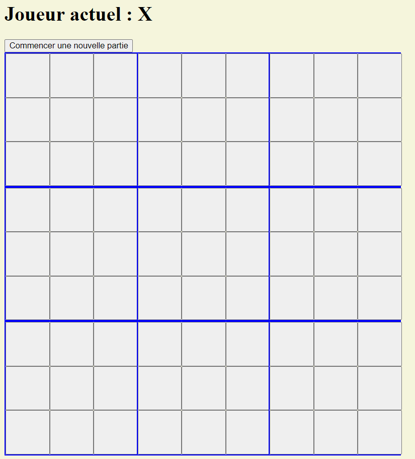
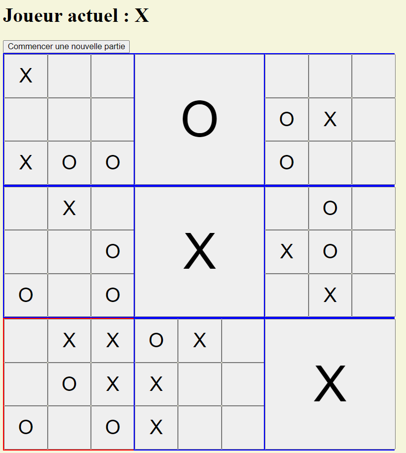
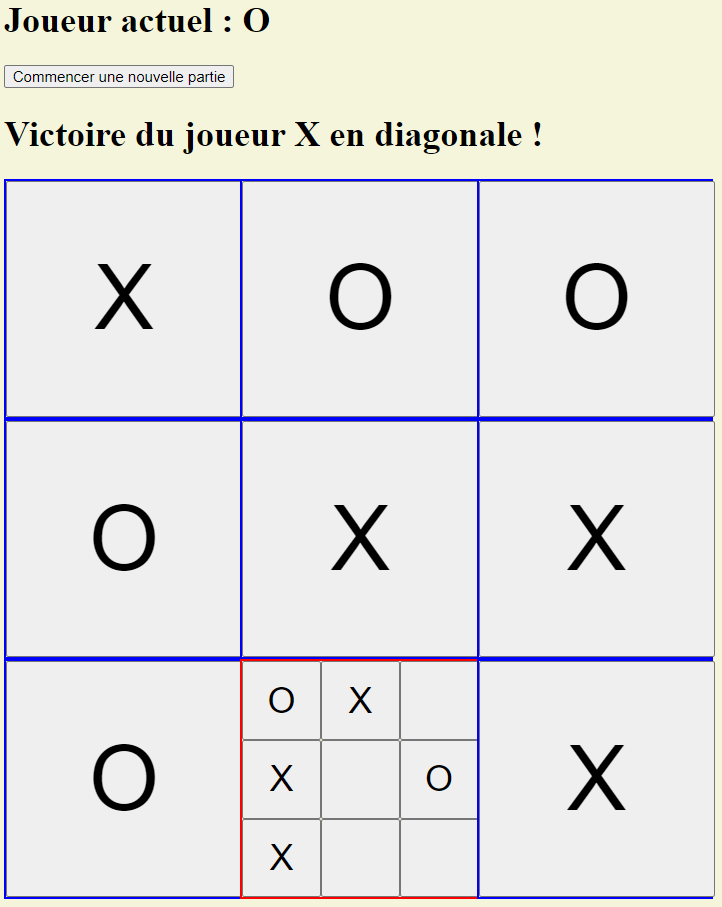

# TicTacToeREMASTERED

There is two ways to play this game.

Easiest one is to download the msi installer available in the "release" section and just install the game.

Second option is to run the project by cloning the source code.
To run this project you will need :
- [Angular CLI](https://github.com/angular/angular-cli) version 17.x
- [Node.js](https://nodejs.org/en/download/current) version 21.x

You can install everything this way (using [Node Version Manager](https://github.com/nvm-sh/nvm) for simplicity) :

```
$ curl -o- https://raw.githubusercontent.com/nvm-sh/nvm/v0.39.7/install.sh | bash

$ nvm install 21

$ nvm use 21

$ npm install -g @angular/cli@17.0.6
``` 

## Play on Development server

Use this command in the project folder to open dev server and play :
```
$ nvm use 21

$ ng serve --open
``` 


# What's this game ?

This game is a Tic-Tac-Toe game but with 9 grids simultaneously !

The goal is to align 3 of your symbol (X or O) in the big grid, in a row, column, or diagonal pattern.
To get a symbol in the grid you need to win in a small grid.
The position of your move in a small grid determine the position of your opponent next move in the big grid, and will be highlighted in red (you can only play in the red hightlighted grid).

## Screenshots from development phase :






